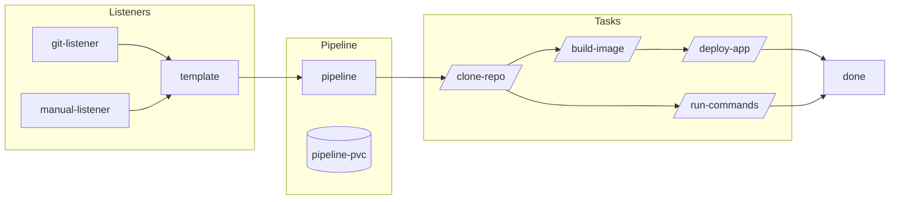
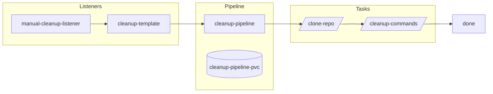

# simple-tekton-toolchain

## To get started, click this button:

### One pipeline to build

```mermaid
flowchart LR

  git-listener
  manual-listener

  git-listener-->template
  manual-listener-->template

  template
  template-->pipeline
  
  subgraph Listeners
    git-listener
    manual-listener
    template
  end

  pipeline
  pipeline-pvc

  pipeline-->clone-repo

  clone-repo-->build-image-->deploy-app
  clone-repo-->run-commands
  deploy-app-->done
  run-commands-->done

  %% clone-repo-.->pipeline-pvc
  %% build-image-.->pipeline-pvc
  %% deploy-app-.->pipeline-pvc
  %% run-commands-.->pipeline-pvc
  
  subgraph Pipeline
    pipeline
    pipeline-pvc[(pipeline-pvc)]
  end

  subgraph Tasks
    clone-repo
    build-image
    deploy-app
    run-commands
  end

  clone-repo[/clone-repo/]
  build-image[/build-image/]
  deploy-app[/deploy-app/]
  run-commands[/run-commands/]
```

### One pipeline to clean up

```mermaid
flowchart LR

  manual-cleanup-listener-->cleanup-template
  cleanup-template-->cleanup-pipeline
  
  subgraph Listeners
    manual-cleanup-listener
    cleanup-template
  end

  cleanup-pipeline
  cleanup-pipeline-pvc

  cleanup-pipeline-->clone-repo

  clone-repo-->cleanup-commands
  cleanup-commands-->done
  
  subgraph Pipeline
    cleanup-pipeline
    cleanup-pipeline-pvc[(cleanup-pipeline-pvc)]
  end

  subgraph Tasks
    clone-repo
    cleanup-commands
  end

  clone-repo[/clone-repo/]
  cleanup-commands[/cleanup-commands/]
```